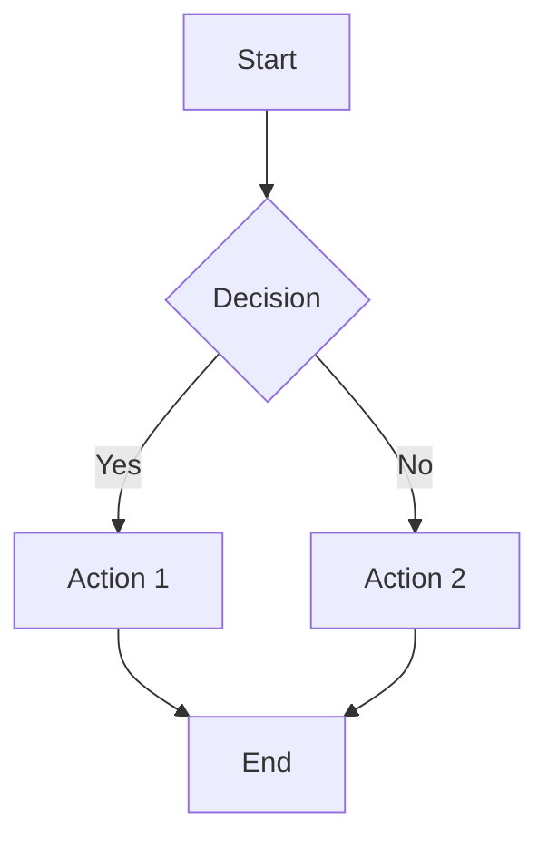

# Markdown Slides Guide

This document outlines principles for building presentation slides using Markdown, inspired by [Deckset](https://www.deckset.com/guides/educators/).

## Core Philosophy

**Plain text to polished slides.** Write content in any text editor using Markdown. The system transforms headings into slides, paragraphs into content, and optional speaker notes into a private presenter view.

Benefits:
- No complex slide editor to learn
- Version control friendly (Git, readable diffs)
- Easy collaboration and long-term maintenance
- Reusable across courses/presentations

---

## Content Scaling Principles

StagDeck automatically scales content to maximize slide real estate while maintaining visual consistency.

### Guiding Rules

1. **Maximize space usage** - Content should fill the available area, not float in a small region
2. **Consistent sizing across slides** - Similar content types should have similar sizes throughout the deck
3. **Animation-stable layouts** - Progressive reveals should not cause content to resize or shift

### Layout Modes

| Mode | Title | Content | Behavior |
|------|-------|---------|----------|
| **Title Only** | ✅ | ❌ | Title scales large, centered vertically and horizontally |
| **Content Only** | ❌ | ✅ | Content fills entire slide (with healthy margins for headers/footers) |
| **Title + Content** | ✅ | ✅ | Title gets fixed header region, content fills remaining area below |

### Scaling Behavior

```
┌─────────────────────────────────────────┐
│ [Header/Footer margin]                  │
├─────────────────────────────────────────┤
│                                         │
│           TITLE ONLY MODE               │
│         (large, centered)               │
│                                         │
├─────────────────────────────────────────┤
│ [Header/Footer margin]                  │
└─────────────────────────────────────────┘

┌─────────────────────────────────────────┐
│ [Header margin]                         │
├─────────────────────────────────────────┤
│                                         │
│         CONTENT ONLY MODE               │
│    (table/list/code fills area)         │
│                                         │
├─────────────────────────────────────────┤
│ [Footer margin]                         │
└─────────────────────────────────────────┘

┌─────────────────────────────────────────┐
│ # Title Area (fixed height ~15-20%)     │
├─────────────────────────────────────────┤
│                                         │
│         CONTENT AREA                    │
│    (fills remaining ~80-85%)            │
│                                         │
├─────────────────────────────────────────┤
│ [Footer margin]                         │
└─────────────────────────────────────────┘
```

### Animation & Progressive Reveal

For build animations (e.g., bullet points appearing one by one), sizing is based on **final content**, not current visible content:

```markdown
# Key Points

- First point      ← visible at step 1
- Second point     ← visible at step 2  
- Third point      ← visible at step 3 (final)
```

**Principle:** Layout is calculated using `final_content` (all items). Only visibility changes during animation, not size or position. This prevents jarring layout shifts.

```python
# Conceptual model
slide.content = "- Point 1"           # Currently visible
slide.final_content = """             # Used for sizing
- Point 1
- Point 2  
- Point 3
"""
# If final_content is not set, defaults to content
```

### Margin Guidelines

| Area | Purpose | Typical Size |
|------|---------|--------------|
| Header margin | Space for slide numbers, logos | 3-5% of height |
| Footer margin | Space for footer text, page numbers | 3-5% of height |
| Side margins | Breathing room, safe area | 3-5% of width |
| Title region | Fixed title area (when present) | 15-20% of height |
| Content region | Main content area | Remaining space |

### Programmatic Scaling (Not Pure CSS)

**Critical principle:** Content scaling is calculated **programmatically** based on content analysis, not purely through CSS. This ensures:

1. **Predictable sizing** - Same content type renders consistently
2. **Overflow prevention** - Content never gets cut off
3. **Optimal readability** - Font sizes stay within readable bounds

#### Scaling Algorithm

```python
# Conceptual algorithm for content scaling
def calculate_scale(content, available_area):
    # 1. Start with default/preferred size
    base_font_size = 1.8  # rem
    
    # 2. Analyze content dimensions
    if is_table(content):
        rows = count_rows(content)
        cols = count_columns(content)
        avg_cell_length = estimate_cell_length(content)
        
        # Scale down if too many rows/cols or long content
        if rows > 6 or cols > 5 or avg_cell_length > 20:
            scale_factor = calculate_fit_scale(rows, cols, available_area)
            return base_font_size * scale_factor
    
    if is_bullet_list(content):
        items = count_items(content)
        max_item_length = max_line_length(content)
        
        # Scale down for many items or long lines
        if items > 8 or max_item_length > 80:
            scale_factor = calculate_fit_scale(items, available_area)
            return base_font_size * scale_factor
    
    return base_font_size
```

#### Scaling Thresholds

| Content Type | Default Size | Scale Down When |
|--------------|--------------|-----------------|
| Bullet list | 1.8rem | > 8 items, or lines > 80 chars |
| Table | 1.6rem | > 6 rows, > 5 cols, or cells > 20 chars avg |
| Code block | 1.4rem | > 15 lines or lines > 60 chars |
| Paragraph | 1.8rem | > 500 chars total |

#### Scale Factors

```
Scale 1.0  = Default size (fits comfortably)
Scale 0.85 = Slightly reduced (moderate content)
Scale 0.7  = Reduced (dense content)
Scale 0.6  = Minimum (very dense, still readable)
```

**Never scale below 0.6** - content should be split across slides instead.

---

## Slide Structure

### Slide Separators

Start a new slide with three dashes on a single line, with blank lines above and below:

```markdown
Content for slide 1

---

Content for slide 2
```

### Headings as Slide Boundaries

Alternatively, treat top-level headings (`#`) as slide dividers:

```markdown
# Introduction

This is the first slide.

# Main Topic

This is the second slide.
```

### Heading Hierarchy

| Element | Purpose |
|---------|---------|
| `#` Top-level headings | Introduce new sections, can act as slide boundaries |
| `##` Subheadings | Structure content within or across slides |
| `###` Sub-subheadings | Further organization within a slide |

---

## Content Elements

### Text & Paragraphs

```markdown
# Slide Title

This is a paragraph of text.

This is another paragraph (blank line creates separation).
```

### Text Emphasis

```markdown
**Bold text** for key terms
*Italic text* for emphasis
`inline code` for technical terms
~~strikethrough~~ for revisions
```

### Lists

**Bullet lists** - ideal for key ideas and takeaways:
```markdown
- First point
- Second point
- Third point
```

**Numbered lists** - for procedures, algorithms, and proofs:
```markdown
1. First step
1. Second step
1. Third step
```

**Nested lists** - show main ideas with supporting details:
```markdown
- Main idea
    - Supporting detail
    - Another detail
        - Even deeper nesting
```

> Indent with 4 spaces for each nesting level.

---

## Build Steps (Progressive Reveal)

Reveal list items one at a time during presentation:

```markdown
build-lists: true

---

# Key Concepts

- First point appears
- Then second
- Then third
```

To show the first item immediately and build the rest:
```markdown
build-lists: not_first
```

---

## Presenter Notes

Keep prompts, examples, and reminders private (not shown on slides).

### Caret Syntax

Paragraphs starting with `^` become presenter notes:

```markdown
# My Slide Title

Visible content on the slide.

^ This is a presenter note - only visible in presenter view.
^ Another note paragraph.
```

### All Paragraphs as Notes

For script-style documents where slides show only headings:

```markdown
paragraphs-as-presenter-notes: true

---

# Topic One

This entire paragraph becomes a presenter note.
The slide only shows the heading.
```

### Best Practices for Notes

- Store definitions, extra explanations, and anecdotes
- Add timing cues for scheduled classes
- Include links and references to check while teaching
- Reuse notes across semesters
- Export as handouts for students

---

## Tables

Use GitHub Flavored Markdown table syntax:

```markdown
| Concept | Definition | Example |
|---------|------------|---------|
| Variable | Named storage | `x = 5` |
| Function | Reusable code | `def foo()` |
| Class | Object template | `class Dog` |
```

---

## Columns

Compare ideas side by side:

```markdown
[.column]
## Pros
- Fast
- Simple
- Portable

[.column]
## Cons
- Limited styling
- No animations
```

> Keep to 2-3 columns for readability.

---

## Code Blocks

Syntax highlighting for dozens of languages:

````markdown
```python
def greet(name):
    return f"Hello, {name}!"

print(greet("World"))
```
````

````markdown
```javascript
const greet = (name) => `Hello, ${name}!`;
console.log(greet("World"));
```
````

---

## Images & Media

### Inline Images

```markdown

```

### Sized Images

```markdown

```

### Background Images

```markdown


# Title Over Image
```

### Videos

```markdown


```

---

## Math (LaTeX/MathJax)

For STEM subjects, write formulas using LaTeX syntax:

```markdown
The quadratic formula: $$x = \frac{-b \pm \sqrt{b^2 - 4ac}}{2a}$$

Inline math: $E = mc^2$
```

---

## Diagrams (Mermaid)

Create flowcharts, sequence diagrams, and more from text:

````markdown

````

---

## Footers & Slide Numbers

Add context and navigation aids:

```markdown
footer: Introduction to Python - Week 3
slidenumbers: true
```

---

## Footnotes

Include citations without cluttering the slide:

```markdown
# Research Findings

Studies show significant improvement[^1].

[^1]: Smith et al., 2023, Journal of Examples
```

---

## Theme Selection Guidelines

| Use Case | Theme Style |
|----------|-------------|
| Theory-heavy lectures | Clean, minimal themes |
| Workshops, projects | More colorful themes |
| Bright rooms | Light backgrounds |
| Dark rooms, recordings | Dark backgrounds |
| Course consistency | Same theme all semester |

---

## Export Options

| Format | Use Case |
|--------|----------|
| Slide-only PDF | Share with students via LMS/email |
| Presenter-note PDF | Rehearsal materials, detailed handouts |
| Multi-slide-per-page | Compact handouts, course recaps |

---

## Workflow Best Practices

1. **Write in plain text** - Use any editor (VS Code, Vim, etc.)
2. **Version control** - Keep slides in Git alongside course materials
3. **Collaborate** - Co-teachers and TAs can contribute via pull requests
4. **Iterate** - Branch experiments, review diffs, roll back when needed
5. **Reuse** - Adapt successful lectures across courses

---

## Quick Reference

```markdown
# Slide Title                    <- New slide (if headers-as-dividers)
## Section                       <- Subheading
---                              <- Explicit slide break

**bold** *italic* `code`         <- Text formatting
- bullet                         <- Unordered list
1. numbered                      <- Ordered list

^ Presenter note                 <- Hidden from slides

                   <- Image
```python                        <- Code block

$$E = mc^2$$                     <- Math formula

footer: My Talk                  <- Footer text
slidenumbers: true               <- Show slide numbers
build-lists: true                <- Progressive reveal
```
